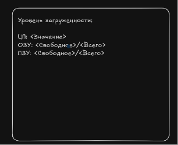
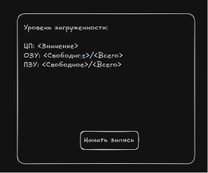
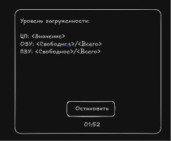
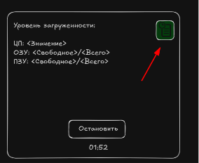
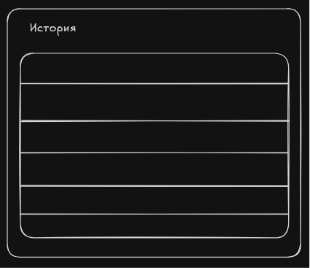

# Тестовое задание от NPO_Automative

## Тестовое задание на позицию Full-stack Python разработчик Junior/Junior+

1. Написать Desktop приложение которое должно запускаться и работать на Linux и выводить уровень 
загруженности ЦП,  ОЗУ и ПЗУ компьютера на котором запущено это приложение в реальном времени.

Время обновления должно быть минимум раз в секунду и иметь возможность задаваться.
(Дизайн может быть любым, на скриншоте пример, как это может быть выглядеть.)

2. Добавить кнопку «Начать запись» после нажатия, запись должна идти в Базу Данных (Любую на выбор) 
по мере обновления значений.

3. После того как запись идет, скрывать или заменять кнопку «Начать запись», и выводить кнопку 
«Остановить» с таймером, который будет выводить время с начала записи в БД.
После нажатия кнопки «Остановить», появляется кнопка «Начать запись», запись в БД прекращается, таймер обнуляется.

 

4. Добавить возможность просматривать историю записи в БД.

При нажатии на иконку/кнопку (на ваш выбор) Должно открываться окно с таблицей в которой будет 
отображаться список записанных в БД строк. Дизайн можно реализовать в свободной форме.

5. Покрыть код тестами на 100%.

6. Заполнить Readme файл, с инструкцией о запуске и работы программы, а так же, с приведением 
скриншотов самой программы  и результатом положительно пройденных тестов. Из-за большого 
количества тестовых – если нет Readme файла с приведенными выше условиями, тестовое не принимается.
 
Будет преимуществом:
–	Добавить action в github на автоматический запуск тестов при пуше в github

Выложить код в репозиторий и прислать результаты работ в телеграм @DeleteAm на проверку.
Также указать время, которое ушло на выполнение этой задачи, ссылку на резюме и резюме в pdf формате

Надеемся что все получится. Удачи!:)

## Решение

