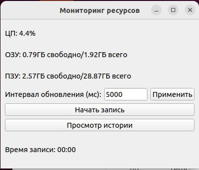
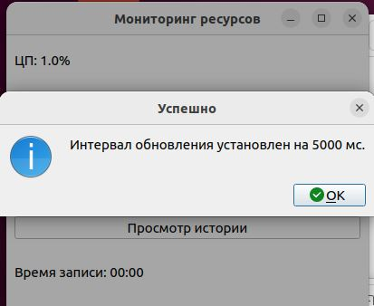
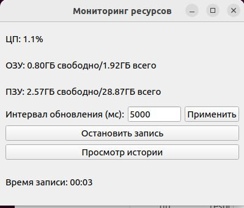
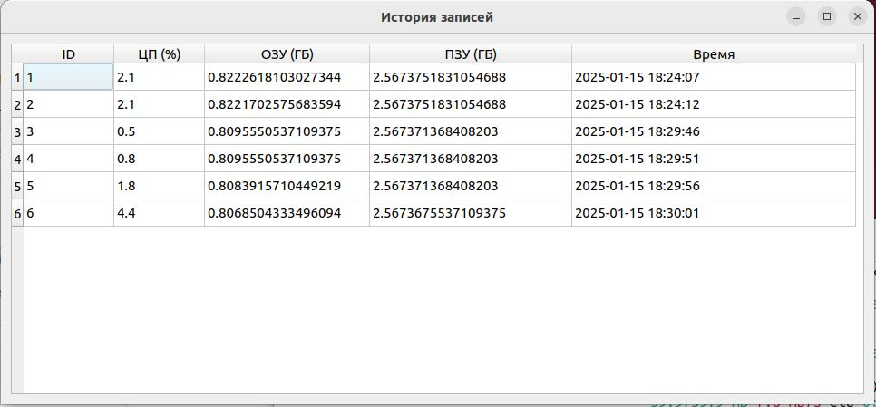
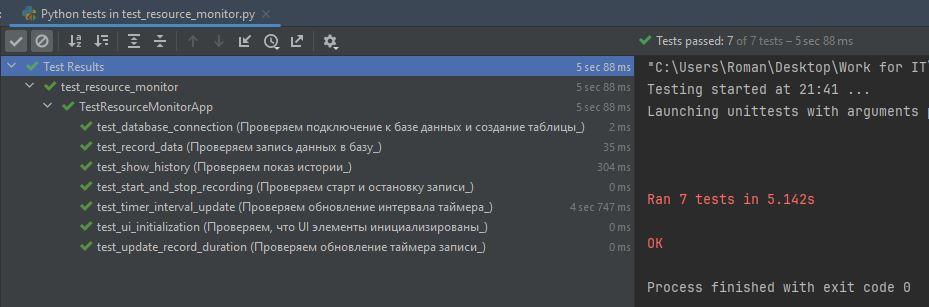
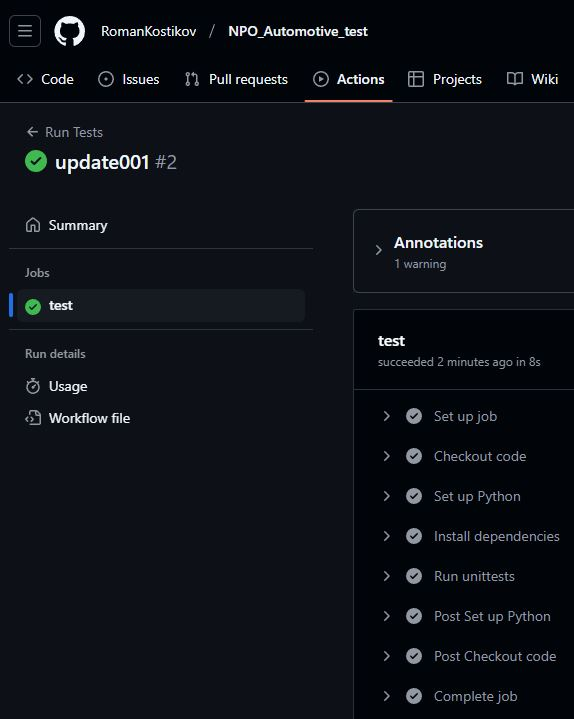
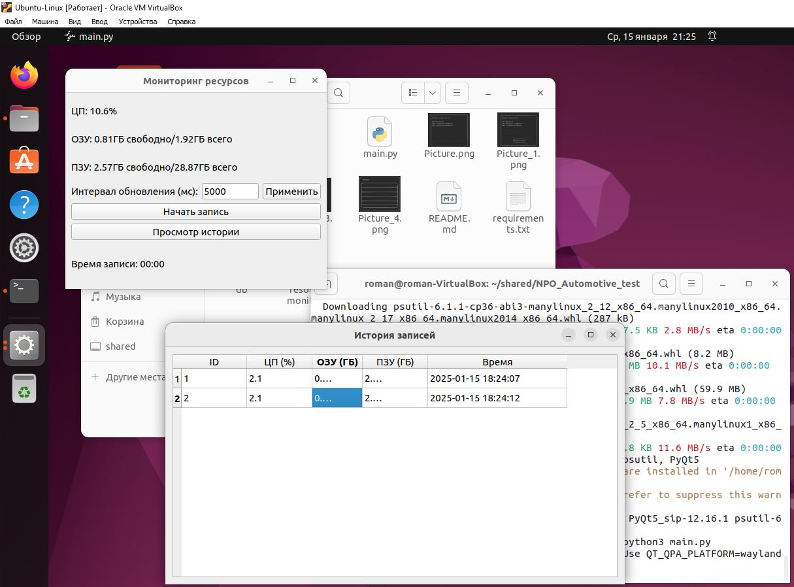

# Тестовое задание от NPO_Automative

## Тестовое задание на позицию Full-stack Python разработчик Junior/Junior+

1. Написать Desktop приложение которое должно запускаться и работать на Linux и выводить уровень 
загруженности ЦП,  ОЗУ и ПЗУ компьютера на котором запущено это приложение в реальном времени.


Время обновления должно быть минимум раз в секунду и иметь возможность задаваться.
(Дизайн может быть любым, на скриншоте пример, как это может быть выглядеть.)

2. Добавить кнопку «Начать запись» после нажатия, запись должна идти в Базу Данных (Любую на выбор) 
по мере обновления значений.


3. После того как запись идет, скрывать или заменять кнопку «Начать запись», и выводить кнопку 
«Остановить» с таймером, который будет выводить время с начала записи в БД.
После нажатия кнопки «Остановить», появляется кнопка «Начать запись», запись в БД прекращается, таймер обнуляется.

 


4. Добавить возможность просматривать историю записи в БД.


При нажатии на иконку/кнопку (на ваш выбор) Должно открываться окно с таблицей в которой будет 
отображаться список записанных в БД строк. Дизайн можно реализовать в свободной форме.


5. Покрыть код тестами на 100%.

6. Заполнить Readme файл, с инструкцией о запуске и работы программы, а так же, с приведением 
скриншотов самой программы  и результатом положительно пройденных тестов. Из-за большого 
количества тестовых – если нет Readme файла с приведенными выше условиями, тестовое не принимается.
 
Будет преимуществом:
–	Добавить action в github на автоматический запуск тестов при пуше в github

Выложить код в репозиторий и прислать результаты работ в телеграм @DeleteAm на проверку.
Также указать время, которое ушло на выполнение этой задачи, ссылку на резюме и резюме в pdf формате

Надеемся что все получится. Удачи!:)

## Решение

## Инструкции по запуску приложения на Linux

## Требования
Перед началом убедитесь, что у вас установлены следующие компоненты:

1. **Python 3.8+**
2. **pip** (менеджер пакетов Python)
3. **Git** (для клонирования репозитория)

---

## Шаги по запуску

### 1. Клонирование репозитория
Склонируйте репозиторий на вашу Linux-машину с помощью команды:
```bash
git clone https://github.com/RomanKostikov/NPO_Automotive_test.git
```
Перейдите в директорию проекта:
```bash
cd NPO_Automotive_test
```

---

### 2. Установка зависимостей

Используйте `pip` для установки всех необходимых библиотек из файла `requirements.txt`:
```bash
pip install -r requirements.txt
```

Если у вас нет `pip`, установите его с помощью команды:
```bash
sudo apt update
sudo apt install python3-pip
```

---

### 3. Запуск приложения
Для запуска приложения выполните следующую команду:
```bash
python3 main.py
```

---

### 4. Создание исполняемого файла (опционально)
Если вы хотите запускать приложение как исполняемый файл, выполните следующие шаги:

1. Добавьте в начало файла `main.py` следующую строку:
   ```python
   #!/usr/bin/env python3
   ```

2. Сделайте файл исполняемым:
   ```bash
   chmod +x main.py
   ```

3. Теперь вы можете запускать приложение как:
   ```bash
   ./main.py
   ```

---

## Дополнительно

### Устранение проблем
1. **Отсутствие зависимостей:**
   Убедитесь, что установлены библиотеки `PyQt5` и `psutil` через:
   ```bash
   pip install PyQt5 psutil
   ```

2. **Проблемы с правами доступа:**
   Если возникают проблемы с правами доступа, используйте `sudo` перед командами.

### Тестирование
Для запуска тестов выполните:
```bash
python3 -m unittest discover -s . -p '*_test.py'
```

---

Теперь приложение готово к использованию. Если у вас есть вопросы или возникли проблемы, 
обратитесь к документации или в репозиторий проекта.

## Скриншоты

Все выполнено согласно ТЗ:













Приложение запущено на Linux:

